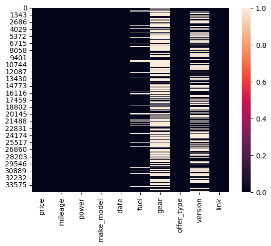
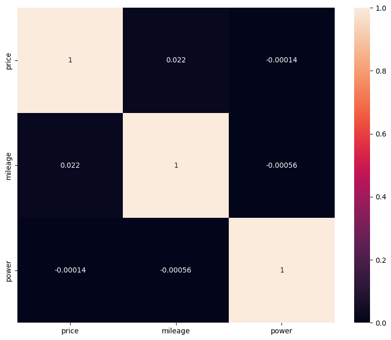

# Laporan Proyek Machine Learning
### Nama : Redy Romadona
### Nim : 211351120
### Kelas : Teknik Informatika Pagi B

## Domain Proyek

Estimasi harga motor ini boleh digunakan sebagai patokan bagi semua orang yang ingin membeli/harga motor yang ada di europa, atau juga bisa digunakan membandingkan atau membuat riset harga motor yang ada di indonesia dan di europa.

## Business Understanding
Harga di sana relatif lebih murah dibandingkan dengan harga pasar yang ada di indonesia


### Problem Statements

 Ke tidak mungkinan bagi seseorang untuk mengunjungi  masing-masing lokasi penjualan motor  dan menanyakan harga pasr motor yang ada di Eroupa

### Goals

mencari solusi untuk memudahkan orang-orang yang mencari patokan harga motor di europa.

Semua poin di atas harus diuraikan dengan jelas. Anda bebas menuliskan berapa pernyataan masalah dan juga goals yang diinginkan.

**Rubrik/Kriteria Tambahan (Opsional)**:
- Menambahkan bagian “Solution Statement” yang menguraikan cara untuk meraih goals. Bagian ini dibuat dengan ketentuan sebagai berikut: 

    ### Solution statements
    - Pengembangan Platform Pencarian Patokan Harga sebuah kendaraan khususnya kendaraan motor Berbasis Web,
     Solusi pertama adalah mengembangkan platform pencarian harga motor berbasis web yang mengintegrasikan data dari Kaggle.com untuk memberikan pengguna akses cepat dan mudah ke informasi tentang estimasi harga motor di eroupa. 
    - Platform ini akan menyediakan antarmuka pengguna yang ramah, memungkinkan pengguna mencari harga motor berdasarkan kriteria tertentu yang di ingin kan konsumen.

Model yang dihasilkan dari datasets itu menggunakan metode Linear Regression.
## Data Understanding
Dataset yang saya gunakan berasal jadi Kaggle yang berisi harga motor Dataset ini merupakan sekummopulan data yang dikumpulkan dari website real estate populer yang ada di europa. Dataset ini menggunakan web dari [kaggle](https://www.kaggle.com/datasets/mexwell/motorbike-marketplace/)

[Motorbike Marketplace](https://www.kaggle.com/datasets/mexwell/motorbike-marketplace/).

Selanjutnya uraikanlah seluruh variabel atau fitur pada data. Sebagai contoh:  

### Variabel-variabel pada Heart Failure Prediction Dataset adalah sebagai berikut:
- Price : merupakan harga motor
- Milage : merupakan jarak tempuh (KM) dari motor tersebut
- Power : Merupakan Power dari motor itu sendiri
- make_model : Merek/brand motor
- fuel : bahan bakar motor tersebut
- date : tahun motor
- version : versi dari motor tersebut


## Data Preparation
Untuk data collection ini, saya mendapatkan dataset yang nantinya digunakan dari website kaggle dengan nama dataset Motorbike Marketplace  jika anda tertarik dengan datasetnya, anda bisa click link diatas.


## Modeling
Untuk bagian ini, kita akan menggunakan teknik EDA.
Pertama kita mengimport semua library yang dibutuhkan

```jupyternotebook
import pandas as pd
import numpy as np
import matplotlib.pypot as plt
import seaborn as sns
```
Karena kita menggunakan google colab untuk mengerjakannya maka kita akan import files juga
```jupyternotebook
from google.colab import files
```
Lalu mengupload token kaggle agar nanti bisa mendownload sebuah dataset dari kaggle melalui google colab
```jupyternotebook
file.upload()
````
Setelah mengupload filenya, maka kita akan lanjut dengan membuat sebuah folder untuk menyimpan file kaggle.json yang sudah diupload tadi

```jupyternotebook
!mkdir -p ~/.kaggle
!cp kaggle.json ~/.kaggle/
!chmod 600 ~/.kaggle/kaggle.json
!ls ~/.kaggle
``````
Done, lalu mari kita download datasetsnya
```jupyternotebook
!kaggle datasets download -d mexwell/motorbike-marketplaceket
````

Selanjutnya kita harus extract file yang tadi telah didownload
````jupyternotebook
!mkdir motorbike-marketplace
!unzip /content/motorbike-marketplace.zip -d motorbike-marketplace
!ls motorbike-marketplace
``````
Mari lanjut dengan memasukkan file csv yang telah diextract pada sebuah variable, dan melihat 5 data paling atas dari datasetsnya
````jupyternotebook
df = pd.read_csv("/content/motorbike-marketplace/europe-motorbikes-zenrows.csv")
df.head()
```````
Untuk melihat mengenai type data dari masing masing kolom kita bisa menggunakan property info,
````python
df.info()
``````
Selanjutnya kita akan memeriksa apakah datasetsnya terdapat baris yang kosong atau null dengan menggunakan seaborn,
````jupyternotebook
sns.heatmap(df.isnull())
``````


Mari kita lanjut dengan data exploration kita,
````jupyternotebook
plt.figure(figsize=(10,8))
sns.heatmap(df.corr(), annot=True)
``````

